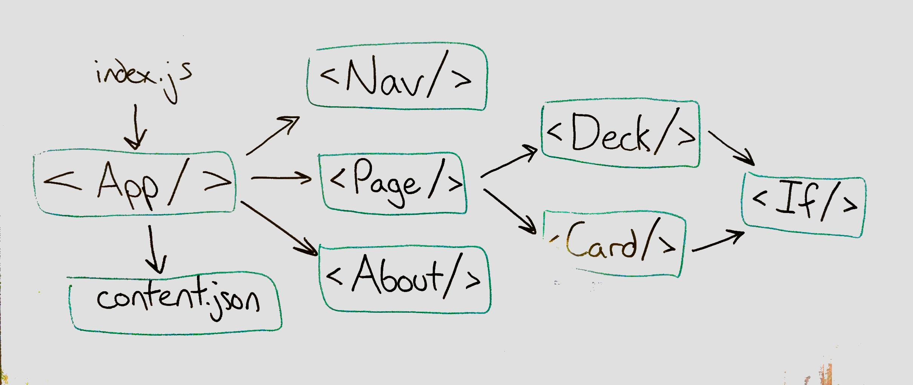

# LAB - 29

## Assignment 1: Practice Component Composition

### Author: Austin Hedeen

### Links and Resources
* [submission PR](https://github.com/austinhedeen-401-advanced-javascript/lab-29a-practice/pull/1)
* [travis](https://travis-ci.com/austinhedeen-401-advanced-javascript/lab-29a-practice)
* [front-end](https://quizzical-golick-9e03a7.netlify.com/)

#### Running the app
* `npm start`

#### Tests
* `npm test`

#### Building a deployment
* `npm run build`
  * Deploy from the `build` directory
  
#### UML

